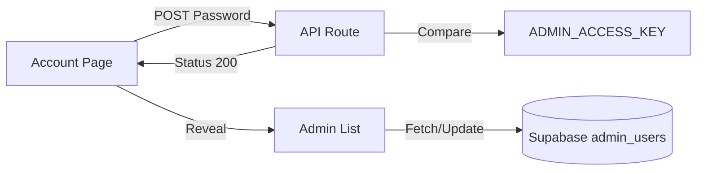

# Admin Management Logic Explained

This document describes how the Protected Admin Management feature is integrated into the Hotel Dashboard.

## 🔗 Connection to Account Page

The logic is housed within `app/dashboard/account/page.tsx`. It acts as a secondary authentication layer:

1.  **User Authentication**: The page is already protected by the `AuthContext`, ensuring only logged-in users with some level of access can see the page at all.
2.  **Feature Authorization**: The "Manage Admins" section is visually hidden behind a cover state.
3.  **Password Gate**: When the user initiates management, they must provide the `ADMIN_ACCESS_KEY`. This key is matched on the server via an API route.
4.  **State Handover**: Once the server returns a "Success" response, the client-side state variable `isUnlocked` is set to `true`, revealing the management table.

## 💾 Data Flow

## 🔐 Key Files

*   `app/dashboard/account/page.tsx`: The UI and state management for the gate.
*   `app/api/admin/manage/route.ts`: Verification and database interaction logic.
*   `.env`: Source of the `ADMIN_ACCESS_KEY`.
